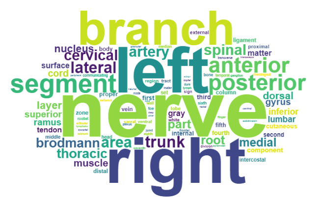

# RadLex_Analysis
[RadLex](http://radlex.org/) is an ontology produced by RNSA focused on the domain of radiology. The goal of this project was to better understand the data contained within the ontology. 

## Radlex Hierarchy Visualization

To visualize the hierarchical structure and distribution of the RadLex ontology, I created an interactive tree diagram with d3.js, which I adapted from the [D3 example](https://observablehq.com/@d3/collapsible-tree). Hovering on a node displays the definition, number of descendant leaf nodes, number of direct children, height (i.e. max distance to leaf node descendant) and clicking on a term opens its RadLex page, if available. Viewing on a large screen is recommended, due to the size of the tree. 

### [View Tree Diagram](https://ashtonomy.github.io/RadLex_Analysis/treemap.html)

## RadLex Word Frequency and Co-Occurrence
The first step in the process was determining the relative frequency of words in the RadLex "Preferred Labels" which was accomplished using NLP++. The preferred labels from the RadLex excel file were converted to a text file which was used as input for the NLP++ analyzer. Each unique word and its count was stored in a knowledge base and sorted by frequency. The [most common English words](https://en.wikipedia.org/wiki/Most_common_words_in_English) were then filtered out and the remaining top 100 words were output to "top100WordCount.txt". 

[Interactive Word Cloud](https://ashtonomy.github.io/RadLex_Analysis/radlexWordCloud.html)

The next goal was to see how these words were associated in the text. I aimed to represent the information as a digraph in which each vertex corresponded to a word in the top 100 list. Arcs were assigned based on co-occurence within the same preferred label, with direction representing occurence of the target word after the source word. Arc weights were assigned an integer value corresponding to number of occurences[^1]. 

To achieve this, each of the top 100 words was mapped to an integer value corresponding to its index in the alphabetically sorted top 100 words list. Using NLP++, the text file of preferred labels was filtered to include only labels including two or more of the top 100 words; furthermore, all words not in the top 100 were excised. A text file was output to "indexList.txt" containing each label on a separate line, with each word replaced with its integer index. Python was used to create an adjacency matrix from this text file, using the numpy library to export the matrix to "adjacencyMatrix.txt". 

Finally, to visualize the data, I created a simple interactive chord diagram in R using the [ChordDiag package](https://github.com/mattflor/chorddiag).

### [View Chord Diagram](https://ashtonomy.github.io/RadLex_Analysis/radlex_interactive.html)

[^1]: N.B. I chose to ignore proximity of word co-occurrences as well as co-occurrences of the same word. Proximity may interesting to revisit in the future, as it may reveal word associations more accurately. Maybe consider scaling arc weights based on distance from center word. 
